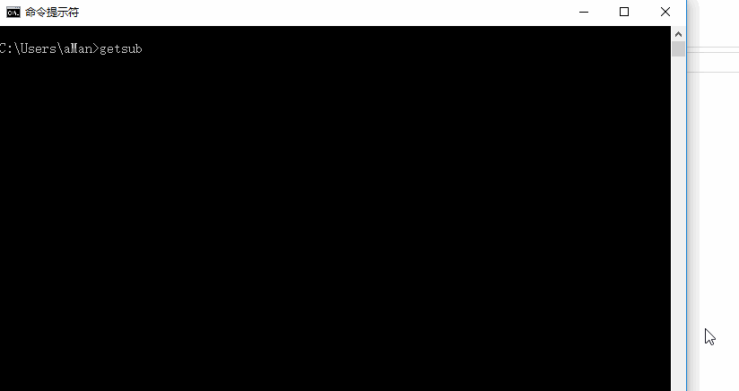

# GetSub


用getsub一步下载字幕。


## 下载


`pip install getsub`


## 使用


兼容python2、3


**下载单视频字幕**：




**下载一个文件夹内的视频文件字幕**：


`getsub` 默认为自动下载字幕压缩包并从中选取它认为最合适的字幕，一般是ass格式、双语字幕， 可以添加 `-q` 参数来手动选择下载的字幕压缩包。

Python2下因为编码原因猜测压缩包中字幕不准确，可以添加 `-s` 参数手动选择压缩包中字幕。


**所有可选参数**：

```
-h          帮助
-q          查询模式，手动选择下载的压缩包
-s          手动选择下载压缩包中要解压的字幕
-o          若视频存在同名字幕，替换已经存在的字幕
-m          保存原始下载字幕压缩包（通常一个字幕压缩包含有多个字幕）
-n          查询模式下显示最大候选字幕数
-d          选择下载器，现在支持subhd、zimuzu和zimuku
--debug     显示报错详细信息
```


## 说明

### 搜索规则

`getsub`会抽取视频名中包含的一下信息进行多次组合搜索，直到候选字幕包数达到设定值（默认为10条，可以通过 `-n` 参数设定）。

- 美剧名（电影名）
- 剧集信息（美剧）
- 年份（电影）
- 分辨率
- 视频格式
- 音频编码格式
- 压制组信息


如视频名为 `Game.of.Thrones.s07e01.1080p.web.h264-tbs.mkv`， 所有组合如下，按搜索顺序先后排列：

```
Game of Thrones s07 e01 1080p WEB-DL tbs 
Game of Thrones s07 e01 1080p WEB-DL  
Game of Thrones s07 e01 1080p   
Game of Thrones s07 e01    
Game of Thrones s07
Game of Thrones (downloader == zimuku)
```

如视频名为 `The.Notebook.2004.720p.BluRay.x264.AC3.3Audio-HDWinG.mkv`， 所有组合如下，按搜索顺序先后排列：

```
The Notebook 2004 720p BluRay 3Audio-HDWinG 
The Notebook 2004 720p BluRay  
The Notebook 2004 720p   
The Notebook 2004
The NoteBook
```


**标准视频名**：

全英文组成，包含美剧名（电影名）， 分辨率， 视频格式， 音频编码格式， 压制组等信息。

如： `Game.of.Thrones.s07e01.1080p.web.h264-tbs.mkv` ， `T2_ Trainspotting (1080p HD).mp4`

**其余视频名**：

其余一般为包含了中文的视频名。

对于包含中文的视频名：

- 若视频名的美剧名（电影名）中中文字数大于英文字数，选取中文作为视频的title
- 若视频名的美剧名（电影名）中英文字数大于等于中文字数，选取英文作为视频的title

其中若名称中英混合，只能作简单过滤中文（英文）字符。

若视频名为 `[SPS辛普森一家字幕组].[丑陋的美国人.第一季].Ugly.Amricans.S01E01.rmvb` 这类， 无法抽取准确的名称。


### 下载来源

关于下载来源，现在首选是从[zimuzu](http://www.zimuzu.tv/)下载字幕，若搜索结果数太少，会继续搜索[zimuku](http://www.zimuku.cn)和[subhd](http://subhd.com)的字幕。

关于下载频率，zimuzu和zimuku目前没有明显的下载频率限制，拖入一个视频文件夹下载一般不会报错。而subhd有下载频率限制，一般每次只能下载一两个视频的字幕，之后需要滑动验证码验证。

若下载出现unknown error，可能就是下载频率过高，可以等一段时间再试。

